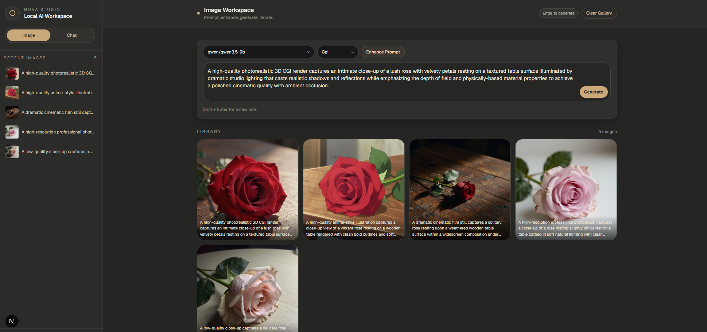
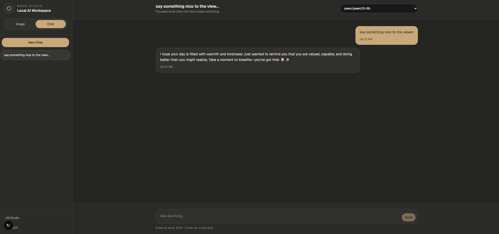

# Nova Studio - Unified Local AI Workspace

A powerful, unified local AI workspace combining image generation, video generation, and chat capabilities. Designed for high-performance creative workflows powered by ComfyUI and LM Studio.

## Workspaces

Nova Studio is organized into three specialized workspaces, accessible via the modular sidebar.

### 1. Image Workspace
- **Turbo Generation** - High-speed image creation using ComfyUI with the z-image-turbo model.
- **LoRA Support** - Enhance images with custom LoRAs and adjustable model strength.
- **Style Presets** - Choose from curated visual styles:
  - **Realistic**: Candid phone snapshot aesthetic.
  - **Photography**: Professional DSLR portrait quality.
  - **Cinematic**: Narrative film frame with dramatic lighting.
  - **Anime**: Modern high-quality Japanese animation style.
  - **CGI**: High-end 3D render (film/game cinematics).
- **Prompt Enhancement** - Automatically rewrite and refine prompts using local LLMs.
- **Integration** - Instantly send generated images to the Video Workspace with a single click.

### 2. Video Workspace (Wan2.2)
- **Image-to-Video Animation** - Animate any image using the state-of-the-art Wan2.2 model.
- **Vision-AI Prompting** - Use vision-capable LLMs (e.g., Llama 3.2 Vision) to analyze your image and generate context-aware motion prompts.
- **Precise Controls**:
  - **Aspect Ratio Matching**: Automatically match video dimensions to the source image.
  - **Resolution Selection**: 480p and 720p output presets.
  - **Duration Control**: adjustable frame count for shorter or longer animations.
- **VRAM Auto-Optimization**: Automatically unloads LLM models from VRAM before starting video generation to ensure maximum stability on single-GPU setups.

### 3. Chat Workspace
- **Local LLM Interaction** - Chat with any GGUF model via LM Studio.
- **Multi-session Management** - Create and organize multiple independent chat sessions.
- **Model Per Session** - Assign different models to different sessions for specialized tasks.
- **Persistence** - All chat history and workspace states are saved to browser localStorage.

## Workflow: From Idea to Animation

1. **Generate**: Create a stunning image in the **Image Workspace** using turbo models and LoRAs.
2. **Transfer**: Click the **"Use for Video"** button on any gallery item to bridge it to the Video Workspace.
3. **Analyze**: Select a **Vision Model** and click **"Enhance"** to have the AI write a cinematic motion prompt based on the image content.
4. **Animate**: Click **"Generate Video"** (Nova Studio will handle VRAM management automatically) and watch your image come to life.

## Screenshots

> **Image Generation**: Modern UI with style presets, LoRA support, and aspect ratio controls.


> **Video Generation**: Image-to-video workflow with motion model selection and duration controls.


> **Chat**: Clean, distraction-free interface for local LLM interaction.


## Architecture

```
┌─────────────────────────────────────────────────────────────┐
│                      Nova Studio (Next.js)                  │
│                      http://localhost:3000                  │
├──────────────────┬───────────────────────┬──────────────────┤
│  Image Workspace │    Video Workspace    │  Chat Workspace  │
├──────────────────┴───────────────────────┴──────────────────┤
│  /api/comfy/*  ──────────────►  ComfyUI  (port 8188)        │
│  /api/lmstudio/* ───────────►  LM Studio (port 1234)        │
└─────────────────────────────────────────────────────────────┘
```

- **Next.js 14/15**: High-performance web interface.
- **ComfyUI**: Backend engine for Z-Image-Turbo and Wan2.2 (Video).
- **LM Studio**: Backend server for LLMs and Vision models.

## Prerequisites

- **OS**: Windows (tested on Windows 11)
- **Hardware**: NVIDIA GPU with 12GB+ VRAM (16GB+ recommended for 720p video).
- **Software**:
  - Node.js 18+ and npm
  - Python 3.11+ (for ComfyUI)
  - [LM Studio](https://lmstudio.ai/) (Local Server enabled on port 1234)

## Setup

### 1. Web UI Setup
```bash
cd comfy-web
npm install
```

### 2. Backend Setup
1. **ComfyUI**: Place the `ComfyUI` folder in the root directory. Ensure required custom nodes (ComfyUI-WanVideo or similar) and models are installed.
2. **LM Studio**: Download your preferred models. For video prompt enhancement, ensure you have at least one **Vision-capable model** (e.g., Llama-3.2-11B-Vision-Instruct).

### 3. Start
```bash
start_all.bat
```

## Tech Stack

- **Frontend**: Next.js (App Router), React 19, TypeScript, Tailwind CSS
- **Creative Engines**: ComfyUI (Image/Video)
- **LLM Engine**: LM Studio (OpenAI-compatible API)
- **UI Architecture**: Modular Workspace components, Sonner toasts, and persistent storage.

## License

Personal use. Individual model licenses apply.

