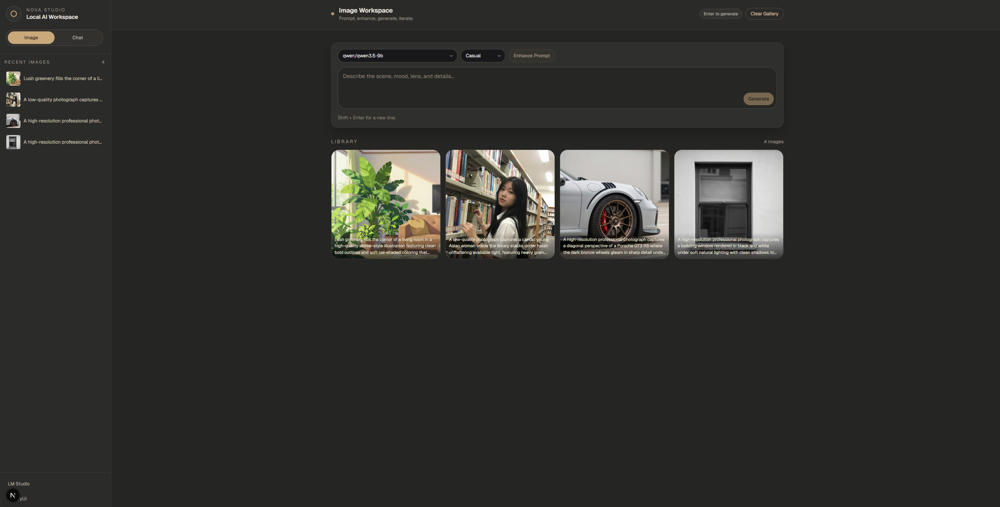
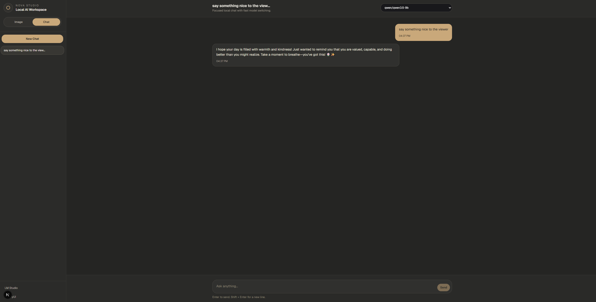

# Nova Studio - Local AI Workspace

A unified local AI workspace combining image generation and chat capabilities. Powered by ComfyUI for image generation and LM Studio for local LLM inference.

## Features

### Image Generation
- **AI Image Generation** - Create images using ComfyUI with the z-image-turbo model
- **Prompt Enhancement** - Automatically enhance your prompts using local LLMs for better results
- **Style Presets** - Choose from multiple visual styles:
  - Casual (iPhone snapshot aesthetic)
  - Professional (DSLR portrait)
  - Cinematic (film still)
  - Anime (manga style)
  - CGI (3D render)
- **Gallery** - View, copy prompts, and manage generated images
- **Local Storage** - Gallery persists in browser localStorage

### Chat
- **Local LLM Chat** - Chat with LLMs running locally via LM Studio
- **Multi-session Support** - Create and manage multiple chat sessions
- **Model Switching** - Switch between downloaded models per session
- **Persistent Chats** - Chat history saved to browser localStorage

## Screenshot

> **Image generation**: The UI of image generation, support multiple image style (casual, professional, cinematic, anime, cgi).



> **Chat**: The UI of chat, support multiple chat sessions and models.



## Architecture

```
┌─────────────────────────────────────────────────────────────┐
│                      comfy-web (Next.js)                     │
│                   http://localhost:3000                      │
├─────────────────────────────────────────────────────────────┤
│  /api/comfy/*  ──────────────►  ComfyUI  (port 8188)        │
│  /api/lmstudio/* ───────────►  LM Studio (port 1234)        │
└─────────────────────────────────────────────────────────────┘
```

- **comfy-web**: Next.js 14 web interface (App Router)
- **ComfyUI**: Image generation engine with z-image-turbo workflow
- **LM Studio**: Local LLM inference server

## Prerequisites

- Windows (tested on Windows 11)
- Node.js 18+ and npm
- Python 3.11+
- NVIDIA GPU with 8GB+ VRAM (recommended for image generation)

## Setup

### 1. Clone and Install Dependencies

```bash
# Install web UI dependencies
cd comfy-web
npm install

# ComfyUI should already have its venv set up
# If not, follow ComfyUI documentation
```

### 2. Download Models

#### For Image Generation (ComfyUI)
Place these files in your ComfyUI models folder:
- `z-image-turbo-fp8-e4m3fn.safetensors` - Main model
- `Qwen3-4B-Q4_K_S.gguf` - CLIP model
- `ae.safetensors` - VAE

#### For LLM Chat (LM Studio)
1. Download [LM Studio](https://lmstudio.ai/)
2. Download GGUF/GGML models through the LM Studio app
3. Load a model on port 1234 (default)

### 3. Start the Application

Run the startup script:
```bash
start_all.bat
```

Or start services manually:
```bash
# Terminal 1: Start ComfyUI
cd ComfyUI
./venv/Scripts/python.exe main.py

# Terminal 2: Start Web UI
cd comfy-web
npm run dev
```

### 4. Access the Application

- **Web UI**: http://localhost:3000
- **ComfyUI**: http://127.0.0.1:8188
- **LM Studio**: http://127.0.0.1:1234

## Usage

### Image Generation Mode

1. Select a LLM model from the dropdown (used for prompt enhancement)
2. Choose a visual style (casual, professional, cinematic, anime, cgi)
3. Enter your image description in the text area
4. Optionally click "Enhance Prompt" to improve your prompt using the LLM
5. Press Enter or click "Generate" to create the image
6. View generated images in the Gallery below

### Chat Mode

1. Click the "Chat" tab in the sidebar
2. Click "New Chat" to start a conversation
3. Select a model from the dropdown (each session can use a different model)
4. Type your message and press Enter to send
5. Switch between sessions using the sidebar

## Configuration

### Environment Variables (Optional)

Create a `.env.local` file in `comfy-web/`:
```env
COMFYUI_URL=http://127.0.0.1:8188
```

### Customizing the Image Workflow

Edit `comfy-web/src/app/api/comfy/route.ts` to modify the ComfyUI workflow or change default models.

## Tech Stack

- **Frontend**: Next.js 14, React, TypeScript, Tailwind CSS
- **Image Generation**: ComfyUI, z-image-turbo model
- **LLM Inference**: LM Studio
- **UI Components**: Custom components with sonner for toasts

## License

This project is for personal use. Model licenses apply separately.